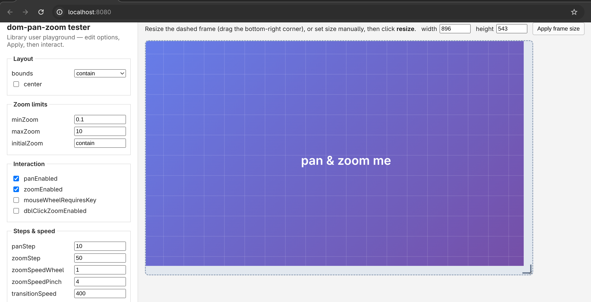

# dom-pan-zoom tester

Minimal playground to try [dom-pan-zoom](https://github.com/stephanwagner/dom-pan-zoom) options and API methods from a library user's perspective.


## Prerequisites

Build dom-pan-zoom first (the tester mounts its `dist/` folder):

```bash
cd ../dom-pan-zoom && npm run build
```

## Run

```bash
docker compose up --build
```

Open [http://localhost:8080](http://localhost:8080)

## Usage

1. Adjust options in the sidebar
2. Click **Apply options** to create a new instance (same as a consumer re-initing the library)
3. Pan/zoom the content with mouse or touch
4. Use **API methods** buttons to call programmatic methods
5. Resize the dashed frame, then click **resize** to test layout recalculation

The library is loaded from `/lib/dom-pan-zoom.umd.js` (volume-mounted from `../dom-pan-zoom/dist`). Rebuild dom-pan-zoom and refresh the page to pick up changes.

## Stop

```bash
docker compose down
```
